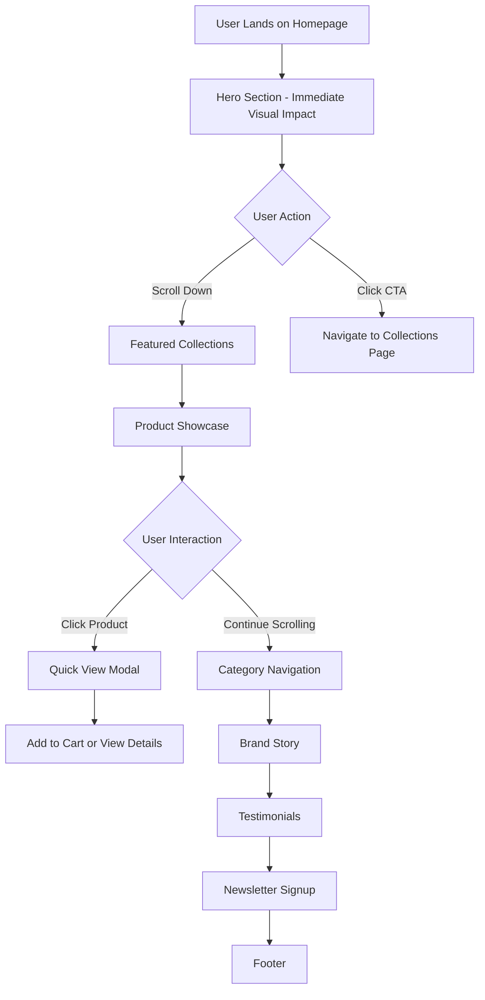

# Homepage Redesign - Design Document

## Overview

The Ishori homepage redesign creates a premium, immersive shopping experience that combines modern e-commerce best practices with Ishori's unique glassmorphism aesthetic. Drawing inspiration from contemporary Indian fashion platforms like Moora.in and Pehrin.com, the design emphasizes visual storytelling, elegant product presentation, and seamless user journeys while maintaining brand consistency.

### Design Goals

1. **Visual Impact**: Create an immediate emotional connection through stunning imagery and elegant typography
2. **Intuitive Navigation**: Enable effortless product discovery through clear categorization and visual hierarchy
3. **Performance**: Deliver fast load times and smooth interactions across all devices
4. **Brand Consistency**: Reinforce Ishori's premium positioning through consistent glassmorphism aesthetics
5. **Conversion Optimization**: Guide users toward product exploration and purchase through strategic CTAs

### Key Design Principles

- **Elegance First**: Every element should reflect premium quality and sophistication
- **Content Breathing Room**: Generous whitespace to let products and imagery shine
- **Progressive Disclosure**: Reveal information gradually to avoid overwhelming users
- **Mobile-First**: Design for mobile experience, then enhance for larger screens
- **Accessibility**: Ensure all users can navigate and shop independently

## Architecture

### Component Hierarchy

```
HomePage
├── HeroSection
│   ├── HeroImage (with parallax effect)
│   ├── HeroContent
│   │   ├── BrandTagline
│   │   └── CTAButtons
│   └── ScrollIndicator
│
├── FeaturedCollectionsSection
│   ├── SectionHeader
│   └── CollectionGrid
│       └── CollectionCard[] (3-6 items)
│           ├── CollectionImage
│           ├── CollectionOverlay
│           └── CollectionInfo
│
├── ProductShowcaseSection
│   ├── SectionHeader
│   ├── ProductGrid
│   │   └── ProductCard[] (4-8 items)
│   │       ├── ProductImage
│   │       ├── WishlistButton
│   │       ├── ProductInfo
│   │       └── QuickViewButton
│   └── ViewAllButton
│
├── CategoryNavigationSection
│   ├── SectionHeader
│   └── CategoryScroller
│       └── CategoryItem[] (6 items)
│           ├── CategoryIcon
│           └── CategoryLabel
│
├── BrandStorySection
│   ├── StoryContent
│   │   ├── StoryHeading
│   │   ├── StoryText
│   │   └── LearnMoreCTA
│   └── StoryImagery
│
├── TestimonialsSection
│   ├── SectionHeader
│   └── TestimonialCarousel
│       ├── TestimonialCard[]
│       │   ├── CustomerQuote
│       │   ├── CustomerRating
│       │   ├── CustomerName
│       │   └── CustomerPhoto (optional)
│       └── CarouselControls
│
├── NewsletterSection
│   ├── NewsletterHeading
│   ├── NewsletterForm
│   │   ├── EmailInput
│   │   └── SubmitButton
│   └── PrivacyText
│
└── QuickViewModal (conditional)
    ├── ModalOverlay
    └── ModalContent
        ├── ProductImageGallery
        ├── ProductDetails
        └── AddToCartButton
```

### Page Flow



### State Management

The homepage will use React hooks for local state management:

- **Loading States**: Track API fetch status for products and collections
- **Modal State**: Control Quick View modal visibility and selected product
- **Carousel State**: Manage testimonial carousel active index and auto-play
- **Form State**: Handle newsletter email input and submission status
- **Wishlist State**: Track wishlist toggle for products (sync with global state)
- **Scroll State**: Track scroll position for animations and parallax effects

## Components and Interfaces

### 1. HeroSection Component

**Purpose**: Create immediate visual impact and communicate brand value proposition

**Visual Design**:
- Full-width, 85vh height on desktop, 70vh on mobile
- High-quality hero image with subtle parallax scroll effect (0.5 speed)
- Centered content overlay with gradient backdrop (linear-gradient from transparent to rgba(104,12,9,0.3))
- Glassmorphism content card: backdrop-filter blur(14px), rgba(255,255,255,0.15) background
- Typography: Playfair Display 64px/48px (desktop/mobile) for tagline
- Two CTAs: Primary (blood red #D00000) and Secondary (vanilla/beige tint) with 16px gap

**Props Interface**:
```typescript
interface HeroSectionProps {
  heroImage: string;
  tagline: string;
  subtitle?: string;
  primaryCTA: {
    text: string;
    link: string;
  };
  secondaryCTA: {
    text: string;
    link: string;
  };
}
```

**Interactions**:
- Parallax effect on scroll (image moves slower than content)
- CTA hover: translateY(-2px), shadow elevation increase
- Scroll indicator pulse animation at bottom

### 2. CollectionCard Component

**Purpose**: Showcase product collections with visual appeal and clear navigation

**Visual Design**:
- Aspect ratio 3:4 (portrait orientation)
- Border-radius: 20px
- Glassmorphism overlay on hover: backdrop-filter blur(8px), rgba(255,255,255,0.25)
- Image: object-fit cover, lazy loaded
- Overlay content: Collection name (24px Playfair), item count (14px Inter)
- Hover transform: scale(1.02), shadow elevation
- Transition: 300ms cubic-bezier(0.4, 0, 0.2, 1)

**Props Interface**:
```typescript
interface CollectionCardProps {
  id: string;
  name: string;
  image: string;
  itemCount: number;
  slug: string;
}
```

**Responsive Behavior**:
- Desktop (>1024px): 3 columns, 24px gap
- Tablet (768-1023px): 2 columns, 20px gap
- Mobile (<768px): 1 column, 16px gap

### 3. ProductCard Component

**Purpose**: Display product information with quick actions

**Visual Design**:
- Glassmorphism card: rgba(255,255,255,0.6) background, 1px border rgba(255,255,255,0.4)
- Border-radius: 20px
- Product image: 280px height, object-fit cover
- Wishlist button: Absolute positioned top-right, heart icon, glass button style
- Product info padding: 16px
- Product name: 16px Inter Semi-bold, 2-line clamp
- Price: 18px Inter Bold, rose gold color
- Quick View button: Appears on hover, glass button, centered

**Props Interface**:
```typescript
interface ProductCardProps {
  product: {
    _id: string;
    name: string;
    price: number;
    images: string[];
    slug: string;
  };
  onQuickView: (productId: string) => void;
  onWishlistToggle: (productId: string) => void;
  isInWishlist: boolean;
}
```

**Interactions**:
- Hover: translateY(-4px), shadow elevation, Quick View button fade in
- Wishlist click: Heart icon fill animation, haptic feedback (if supported)
- Quick View click: Open modal with product details

### 4. CategoryItem Component

**Purpose**: Enable quick category-based navigation

**Visual Design**:
- Circular or rounded-square container (120px diameter on desktop, 100px on mobile)
- Glassmorphism background: rgba(255,255,255,0.4), backdrop-filter blur(10px)
- Category image: 80% of container size, centered
- Category label: Below container, 14px Inter Medium, centered
- Hover: scale(1.05), shadow elevation

**Props Interface**:
```typescript
interface CategoryItemProps {
  name: string;
  icon: string;
  slug: string;
}
```

**Responsive Behavior**:
- Desktop: Grid layout, 6 columns
- Mobile: Horizontal scroll with snap points, 3.5 items visible

### 5. TestimonialCard Component

**Purpose**: Display customer reviews to build trust

**Visual Design**:
- Glassmorphism card: rgba(255,255,255,0.6), border-radius 16px
- Padding: 24px
- Quote icon: Decorative, top-left, mauve color, 32px
- Quote text: 16px Cormorant Garamond Italic, 4-line clamp
- Star rating: 5 stars, filled based on rating, 16px size
- Customer info: Flex row, 12px gap
  - Photo: 48px circle (if available)
  - Name: 14px Inter Semi-bold
  - Verified badge: Small checkmark icon

**Props Interface**:
```typescript
interface TestimonialCardProps {
  quote: string;
  customerName: string;
  rating: number;
  customerPhoto?: string;
  verified?: boolean;
}
```

**Carousel Behavior**:
- Auto-rotate every 5 seconds
- Pause on hover
- Navigation arrows on desktop
- Swipe gestures on mobile
- Dot indicators at bottom

### 6. QuickViewModal Component

**Purpose**: Allow users to view product details without leaving homepage

**Visual Design**:
- Full-screen overlay: rgba(0,0,0,0.6), backdrop-filter blur(4px)
- Modal container: Max-width 900px, glassmorphism card
- Two-column layout on desktop (image left, details right)
- Single column on mobile (image top, details bottom)
- Close button: Top-right, glass button with X icon
- Image gallery: Main image with thumbnail strip below
- Product details: Name, price, description, size selector, quantity, Add to Cart CTA

**Props Interface**:
```typescript
interface QuickViewModalProps {
  isOpen: boolean;
  onClose: () => void;
  product: {
    _id: string;
    name: string;
    price: number;
    images: string[];
    description: string;
    sizes: string[];
    inStock: boolean;
  } | null;
}
```

**Interactions**:
- Open: Fade in overlay, scale up modal from 0.9 to 1
- Close: Click overlay, click close button, or press Escape key
- Add to Cart: Show success toast, update cart count in navbar

### 7. NewsletterSection Component

**Purpose**: Capture email subscriptions for marketing

**Visual Design**:
- Full-width section, gradient background (soft rose to lavender)
- Centered content, max-width 600px
- Heading: 32px Playfair Display, centered
- Subtext: 16px Inter, centered, muted color
- Form: Flex row on desktop, column on mobile
  - Email input: Glassmorphism style, 48px height, rounded-full
  - Submit button: Rose gold gradient, rounded-full, 48px height
- Privacy text: 12px, muted, centered below form
- Success/Error message: Toast notification

**Props Interface**:
```typescript
interface NewsletterSectionProps {
  onSubmit: (email: string) => Promise<void>;
}
```

**Form Validation**:
- Email format: Regex `/^[^\s@]+@[^\s@]+\.[^\s@]+$/`
- Required field validation
- Disable submit during API call
- Show loading spinner in button during submission

## Data Models

### Product Model (Frontend)

```typescript
interface Product {
  _id: string;
  name: string;
  slug: string;
  description: string;
  price: number;
  compareAtPrice?: number;
  images: string[];
  category: string;
  subcategory?: string;
  sizes: string[];
  colors: string[];
  inStock: boolean;
  featured: boolean;
  rating: number;
  reviewCount: number;
  tags: string[];
  createdAt: string;
}
```

### Collection Model (Frontend)

```typescript
interface Collection {
  _id: string;
  name: string;
  slug: string;
  description: string;
  image: string;
  itemCount: number;
  featured: boolean;
}
```

### Testimonial Model

```typescript
interface Testimonial {
  id: string;
  quote: string;
  customerName: string;
  rating: number;
  customerPhoto?: string;
  verified: boolean;
  date: string;
}
```

### Newsletter Subscription

```typescript
interface NewsletterSubscription {
  email: string;
  source: 'homepage' | 'footer' | 'checkout';
  timestamp: string;
}
```

## Error Handling

### API Error Scenarios

1. **Product Fetch Failure**
   - Display: Friendly error message "Unable to load products. Please refresh the page."
   - Fallback: Show empty state with retry button
   - Log: Error details to console for debugging

2. **Image Load Failure**
   - Display: Placeholder image with brand logo
   - Fallback: Use next available image in array
   - Lazy loading: Retry once after 2 seconds

3. **Newsletter Subscription Error**
   - Display: Toast notification with specific error message
   - Validation errors: Inline error text below input
   - Network errors: "Connection issue. Please try again."

4. **Quick View Modal Error**
   - Display: Error message within modal
   - Fallback: "View Full Details" button to product page
   - Close modal automatically after 3 seconds

### Loading States

1. **Initial Page Load**
   - Hero: Show immediately (no skeleton)
   - Products: Skeleton cards matching final layout
   - Collections: Skeleton cards with shimmer effect

2. **Quick View Modal**
   - Show loading spinner while fetching product details
   - Disable Add to Cart button until loaded

3. **Newsletter Form**
   - Disable input and button during submission
   - Show spinner icon in submit button
   - Re-enable on success or error

### Offline Handling

- Detect offline status using `navigator.onLine`
- Display banner: "You're offline. Some features may not work."
- Cache hero image and critical assets using service worker
- Queue newsletter submissions for retry when online

## Testing Strategy

### Unit Testing

**Components to Test**:
1. ProductCard
   - Renders product information correctly
   - Wishlist toggle updates state
   - Quick View button triggers callback
   - Hover interactions apply correct styles

2. CollectionCard
   - Displays collection data
   - Navigation link is correct
   - Hover overlay appears

3. NewsletterSection
   - Email validation works
   - Form submission calls API
   - Success/error messages display
   - Prevents duplicate submissions

4. TestimonialCarousel
   - Auto-rotation works
   - Pause on hover
   - Navigation arrows change slides
   - Dot indicators sync with active slide

**Testing Tools**: Jest + React Testing Library

**Example Test**:
```javascript
describe('ProductCard', () => {
  it('should display product name and price', () => {
    const product = {
      _id: '1',
      name: 'Silk Saree',
      price: 5999,
      images: ['image.jpg']
    };
    render(<ProductCard product={product} />);
    expect(screen.getByText('Silk Saree')).toBeInTheDocument();
    expect(screen.getByText('₹5,999')).toBeInTheDocument();
  });

  it('should call onQuickView when Quick View button is clicked', () => {
    const onQuickView = jest.fn();
    render(<ProductCard product={mockProduct} onQuickView={onQuickView} />);
    fireEvent.click(screen.getByText('Quick View'));
    expect(onQuickView).toHaveBeenCalledWith('1');
  });
});
```

### Integration Testing

**Scenarios to Test**:
1. Homepage loads and fetches products from API
2. Quick View modal opens and displays product details
3. Newsletter form submits and shows success message
4. Category navigation links to correct collection pages
5. Wishlist toggle updates global state

**Testing Tools**: Jest + React Testing Library + MSW (Mock Service Worker)

### Visual Regression Testing

**Approach**:
- Capture screenshots of homepage at different breakpoints
- Compare against baseline images
- Flag visual differences for review

**Tools**: Percy or Chromatic

**Breakpoints to Test**:
- Mobile: 375px, 414px
- Tablet: 768px, 1024px
- Desktop: 1280px, 1440px, 1920px

### Performance Testing

**Metrics to Monitor**:
1. **Largest Contentful Paint (LCP)**: < 2.5s
2. **First Input Delay (FID)**: < 100ms
3. **Cumulative Layout Shift (CLS)**: < 0.1
4. **Time to Interactive (TTI)**: < 3.5s
5. **Total Page Size**: < 2MB

**Tools**: Lighthouse, WebPageTest

**Optimization Checklist**:
- [ ] Images optimized (WebP format, responsive sizes)
- [ ] Lazy loading implemented for below-fold content
- [ ] Critical CSS inlined
- [ ] Fonts preloaded
- [ ] JavaScript code-split by route
- [ ] API responses cached appropriately

### Accessibility Testing

**Manual Testing**:
- [ ] Keyboard navigation works for all interactive elements
- [ ] Screen reader announces content correctly
- [ ] Focus indicators are visible
- [ ] Color contrast meets WCAG AA standards
- [ ] Images have descriptive alt text

**Automated Testing**:
- Tools: axe-core, Lighthouse accessibility audit
- Run on every component
- Fail build if critical issues found

**Example Accessibility Test**:
```javascript
import { axe, toHaveNoViolations } from 'jest-axe';

expect.extend(toHaveNoViolations);

it('should have no accessibility violations', async () => {
  const { container } = render(<HomePage />);
  const results = await axe(container);
  expect(results).toHaveNoViolations();
});
```

### Cross-Browser Testing

**Browsers to Test**:
- Chrome (latest 2 versions)
- Firefox (latest 2 versions)
- Safari (latest 2 versions)
- Edge (latest version)
- Mobile Safari (iOS 14+)
- Chrome Mobile (Android 10+)

**Testing Approach**:
- Automated: BrowserStack or Sauce Labs
- Manual: Test critical user flows on each browser

## Design Specifications

### Spacing System

```css
--spacing-xs: 4px;
--spacing-sm: 8px;
--spacing-md: 16px;
--spacing-lg: 24px;
--spacing-xl: 32px;
--spacing-2xl: 48px;
--spacing-3xl: 64px;
--spacing-4xl: 96px;
```

### Typography Scale

```css
/* Headings */
--font-size-h1: 64px; /* Hero title */
--font-size-h2: 48px; /* Section titles */
--font-size-h3: 32px; /* Subsection titles */
--font-size-h4: 24px; /* Card titles */

/* Body */
--font-size-lg: 18px; /* Large body text */
--font-size-base: 16px; /* Default body text */
--font-size-sm: 14px; /* Small text */
--font-size-xs: 12px; /* Extra small text */

/* Line Heights */
--line-height-tight: 1.2;
--line-height-normal: 1.5;
--line-height-relaxed: 1.75;
```

### Color Tokens (Updated from Brand Guidelines)

```css
/* Primary Brand Colors */
--color-blood-red: #D00000;
--color-rosso-corsa: #D00000;
--color-lava-falls: #A52A2A;
--color-deep-burgundy: #680C09;
--color-vanilla: #FFD8D9;
--color-peach-schnapps: #FFD8D9;

/* Neutrals */
--color-white: #FFFFFF;
--color-off-white: #F7F3EF;
--color-beige: #DACBB7;
--color-black: #010101;
--color-gray-light: #F5F5F5;
--color-gray-medium: #9CA3AF;
--color-gray-dark: #4B5563;

/* Spring Palette (Accent Colors) */
--color-olive: #8E8B63;
--color-sage: #D6D4AD;
--color-blush-pink: #EDDADA;
--color-dusty-rose: #CB8587;

/* Modern Accent */
--color-yimm-blue: #2EAC88;
--color-old-lace: #FFF3E1;
--color-accent-red: #FA2D1A;

/* Functional */
--color-success: #10B981;
--color-error: #D00000;
--color-warning: #F59E0B;
--color-info: #2EAC88;
```

### Glassmorphism Tokens

```css
--glass-bg-light: rgba(255, 255, 255, 0.15);
--glass-bg-medium: rgba(255, 255, 255, 0.25);
--glass-bg-heavy: rgba(255, 255, 255, 0.4);
--glass-border: rgba(255, 255, 255, 0.3);
--glass-blur: blur(14px);
--glass-shadow: 0 8px 32px rgba(107, 45, 92, 0.08);
```

### Animation Tokens

```css
--transition-fast: 150ms cubic-bezier(0.4, 0, 0.2, 1);
--transition-normal: 300ms cubic-bezier(0.4, 0, 0.2, 1);
--transition-slow: 500ms cubic-bezier(0.4, 0, 0.2, 1);
```

### Breakpoints

```css
--breakpoint-mobile: 320px;
--breakpoint-tablet: 768px;
--breakpoint-desktop: 1024px;
--breakpoint-wide: 1440px;
```

## Implementation Notes

### Performance Optimizations

1. **Image Optimization**
   - Use WebP format with JPEG fallback
   - Implement responsive images with srcset
   - Lazy load images below the fold
   - Use blur-up placeholder technique

2. **Code Splitting**
   - Lazy load QuickViewModal component
   - Separate vendor bundles
   - Route-based code splitting

3. **Caching Strategy**
   - Cache product images (1 week)
   - Cache API responses (5 minutes)
   - Use service worker for offline support

### SEO Considerations

1. **Meta Tags**
   ```html
   <title>Ishori - Premium Indian Sarees | Elegance Redefined</title>
   <meta name="description" content="Discover exquisite silk, cotton, and designer sarees at Ishori. Premium quality, traditional craftsmanship, modern elegance." />
   <meta property="og:title" content="Ishori - Premium Indian Sarees" />
   <meta property="og:image" content="https://ishori.com/og-image.jpg" />
   ```

2. **Structured Data**
   - Implement Product schema for featured products
   - Add Organization schema for brand info
   - Include BreadcrumbList schema

3. **Semantic HTML**
   - Use proper heading hierarchy
   - Implement landmark regions (header, nav, main, footer)
   - Add descriptive link text

### Accessibility Enhancements

1. **Keyboard Navigation**
   - All interactive elements focusable
   - Logical tab order
   - Skip to main content link

2. **Screen Reader Support**
   - ARIA labels for icon buttons
   - ARIA live regions for dynamic content
   - Descriptive alt text for images

3. **Visual Accessibility**
   - Minimum 4.5:1 contrast ratio
   - Focus indicators visible
   - No information conveyed by color alone

This design document provides a comprehensive blueprint for implementing the Ishori homepage redesign, ensuring a premium, performant, and accessible shopping experience.
